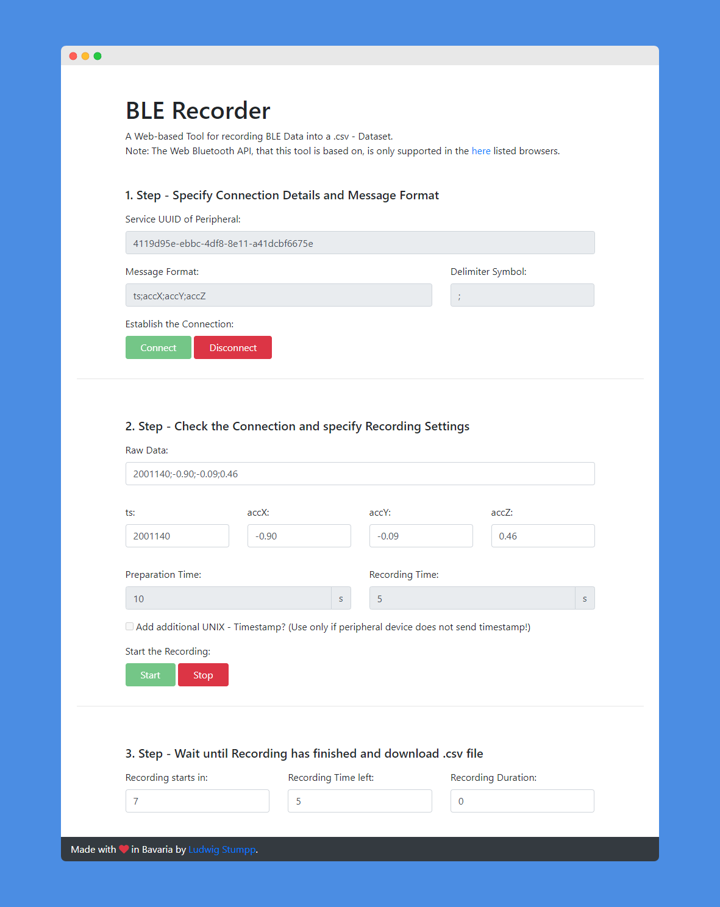

# BLE-Recorder
A web-based tool for recording BLE data sent as a String format from a peripheral device and converting it into a .csv file. Visit https://ble-recorder.herokuapp.com to access the hosted version or run it locally on your browser by first downloading the repository.

BLE-Recorder builds upon the provided functionality of [p5.ble.js](https://github.com/ITPNYU/p5.ble.js) and is inspired by their [examples](https://itpnyu.github.io/p5ble-website/docs/quick-start) shown on their website.

## 1. General Information

### 1.1 Functionality
This tool is based on the Bluetooth Low Energy (BLE) standard as supported through the [Web Bluetooth API]("https://developer.mozilla.org/en-US/docs/Web/API/Web_Bluetooth_API"). It allows to record information sent from a peripheral device to then be converted into a .csv file. For a introduction on BLE, please refer to [this blog post](https://www.arduino.cc/en/Reference/ArduinoBLE) on the Arduino website.

### 1.2 Motivation
This tool was initially developped to simplify the process of collecting data from your Arduino boards with BLE support. This allows more flexibility since one does not require a connection of the board with your computer, but only power connection through e.g a PowerBank.

## 2. How to use

### 2.1 Download and customize Arduino Sample Code
To get started, take a loot at the Arduino sample code provided at `arduino/ACC_BLE.ino`. This is an example on how to send data from an Accelerometer via Bluetooth Low Energy.

For sending your own BLE data, please first generate a unique UUID with [this tool](https://www.uuidgenerator.net/), to then enter it at the beginning of the Arduino file.

After you made your changes and uploaded the program onto your device, you can verify using Apps such as the one from [LightBlue® — Bluetooth Low Energy](https://play.google.com/store/apps/details?id=com.punchthrough.lightblueexplorer&hl=de&gl=US).

### 2.2 Visit the Web App and change Message Protocol
Now that your peripheral device is sending data, we can read it on the web-based recorder tool. Visit https://ble-recorder.herokuapp.com to access the hosted version on Heroku.

At the very top, start with entering the unique UUID of your peripheral device.

As this tool expects the data to be encoded in a message string, we next need to specify the format and the delimiter of the message. The prefilled values correspond to the data sent by the example code provided at `arduino/ACC_BLE.ino`.

Then we can establish the connection, verify that the data format can be parsed and start the recording. After the recording has finished, the recorded .csv file is automatically downloaded.

## 3. Notes on Performance

### 3.1 Suboptimal Encoding of Information as Strings
Encoding floating point and integral values in a string format is suboptimal in terms of the number of bytes required.
However, due to the lower complexity of the web app's user interface, it was decided to support only string messages in this first version of the BLE recorder tool.
Since any type of information can be converted to string format in some way, this solution can be used consistently.

### 3.2 Performance of own Tests
The following experiments where performed on a Arduino Nano 33 BLE Sense Board with a code similar to the provided example in `arduino/ACC_BLE.ino`.
For every experiment, the average sampling rate was roughly observed:
- message length of 64 characters -> ~ 40ms sampling period.
- message length of 28 characters -> ~ 10ms sampling period.

Note that the sampling period will increase with longer messages.

## 4. Known Issues

### 4.1 Browser support and maximum message length
For an overview of the supported browsers, see the [browser support of the Web Bluetooth API](https://developer.mozilla.org/en-US/docs/Web/API/Web_Bluetooth_API).

Furthermore, there seems to be a limit on the maximum message length depending on the browser version:
- Google Chrome Version 92.0 on Android only supports maximum message length of 20 characters.
- On Win10 the same version seems to work for at least up to 64 characters (true limit not measured).

## 5. Contributing

Pull requests are welcome. For major changes, please open an issue first to discuss what you would like to change.

## 6. License

This software is published under the [MIT License](https://choosealicense.com/licenses/mit/).
